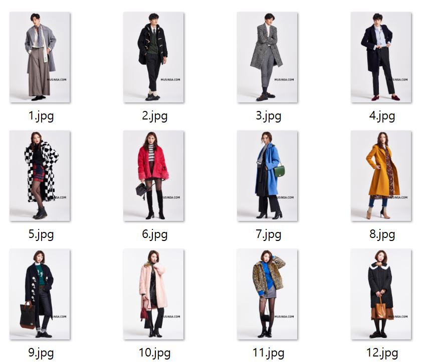
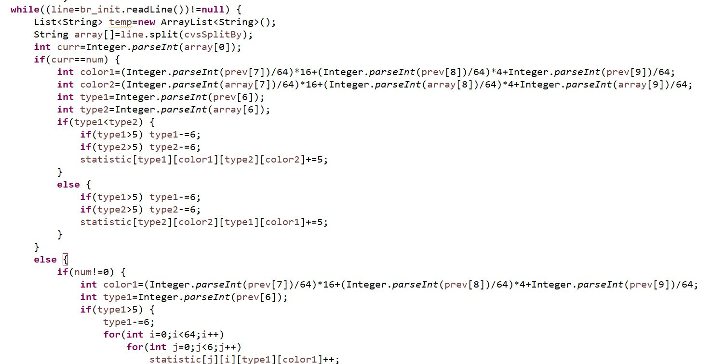

##<Data 크롤링, 머신러닝 담당: 김민석, 박지원>

# 트레이닝 세트 크롤링

  쇼핑몰 MUSINSA에는 "스탭스냅"이라는 코너가 있다. 

무신사 소속 모델들의 촬영 사진, 혹은 작가들이 길에서 섭외한 일일 모델들의 촬영 사진이 올라온다.

이 사진들은 해당 년도의 패션을 가장 잘 드러내며, 누구나 알기 쉽게 간결하고 깔끔하게 이미지가 구성되어있다. 

2016년도부터 2019년까지 대략 40000만장의 사진이 있어 이를 트레이닝 세트로 활용하기에 적합하다고 판단했다. 

# 테스트 세트 크롤링

  Clothing-Co-Parsing dataset을 활용하여 위의 트레이닝 세트로도 올바르게 옷의 종류를 구별하고, 옷의 색깔을 판단하는지 검토했다. 

아래 보이는 사진과 같이 구도가 조금 변경ㅇ되거나, 배경이 추가되어도 문제 없이 데이터를 측정하는 것을 알 수 있다. 

##<사용자 입력, I/O 모듈 담당: 장윤희, 임채진>

# CSV 파일 분석

  위 트레이닝 세트의 아웃풋은 .csv 파일에 "," 구분자로 구별되어 저장된다. 

이때 가장 앞의 1자리는 순번, 그를 잇는 4자리는 BOX의 위치를 의미한다. 

이는 DeepFasion2.api에 구현 되어있는 기능으로써 우리는 필요 없다고 판단하여 사용하지 않았다. 

우리는 Type를 의미하는 0~12의 수와 그 뒤 R, G, B 색상코드를 의미하는 수를 활용했다. 

# .csv 파일 처리
  위의 raw 데이터를 활용하기 위한 형태로 변형 해줘야 한다. 

우선, 각 색상 코드는 64단위로 구분하여 총 4x4x4=64종류의 색이 존재한다고 추상화했다. 

이후 옷 순번이 같은 두 옷(상, 하의)을 조합하여 빈도수를 배열에 저장했다. 

이때 옷이 한 의상만 측정이 된 경우(원피스 등) 해당 옷 자체의 빈도수가 반영되어야 한다고 판단하여 앞선 경우 조합의 빈도수는 5, 옷 하나의 빈도수는 1의 가중치를 두고 저장했다. 

# 사용자 Input을 점수로 변환

  사용자는 Java 콘솔에 자신의 파일의 경로를 입력하도록 되어있다. 

이렇게 받은 경로를 Main.java가 받아서 detect_image.py의 인자로 전달한다. 

여기서 받은 경로를 통해 읽을 이미지를 선택하고, detect_image.py는 한 장의 사진을 분석하여 트레이닝 된 결과와 같이 .csv 파일의 형식으로 출력한다. 

이때 새로 작성한 .csv 파일과 이전에 저장한 빈도수의 값을 비교하여 점수로 환산해준다. 점수는 최대 빈도수로 자신의 수를 나눈 빈도수이다. 

